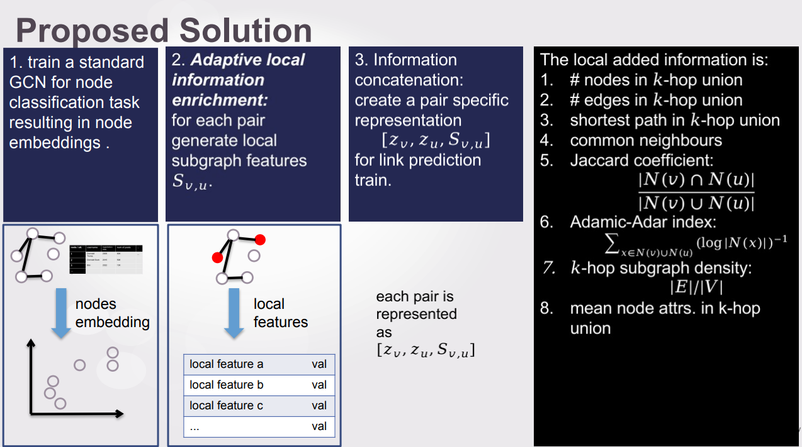
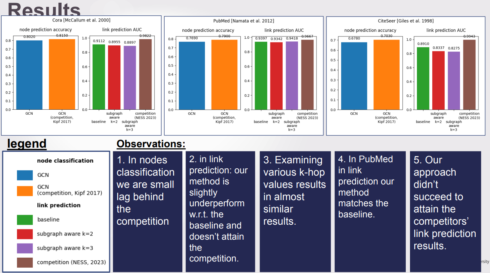

# Adaptive Subgraph-aware Node Embedding (AdSNE)

**AdSNE** is a research prototype that explores whether a **single node embedding** can support **multi-order graph tasks**:
- Node classification (order 1)
- Link prediction (order 2)
- Potential extensions to graph-level tasks (order ∞)

## Motivation

In graph learning, many tasks rely on node embeddings. However:
- Embeddings optimized for node-level tasks (e.g., classification) often perform poorly on edge- or graph-level tasks, this supported by Theoretical Result [Bevilacqua et al. ICLR-25].
- Real-world applications require **shared embeddings** that can serve multiple task types.

This raises the core question: **Can we learn one embedding to rule them all?**

## Proposed Solution

## Experimental Results

- Examined Datasets: Cora, CiteSeer and PubMed.

